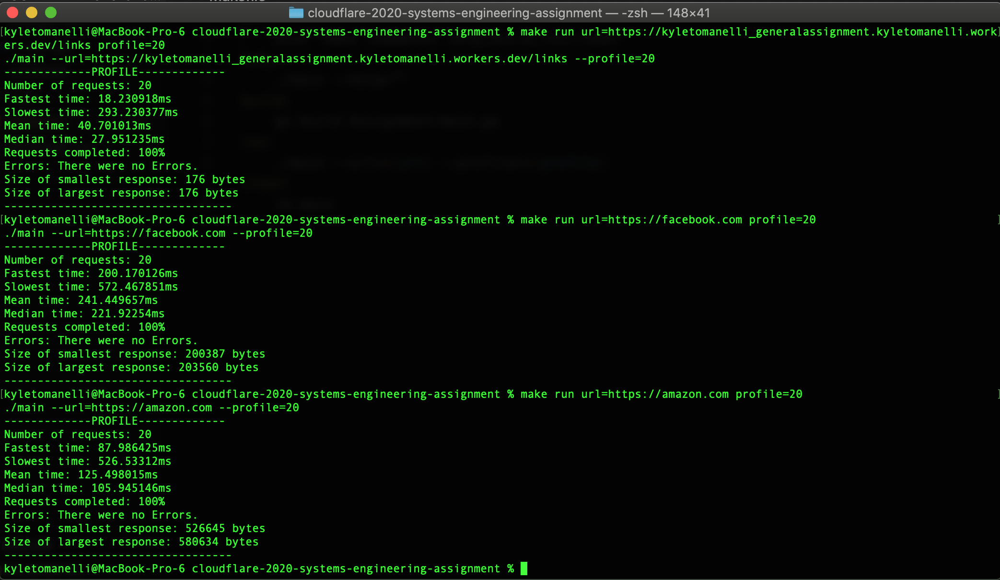
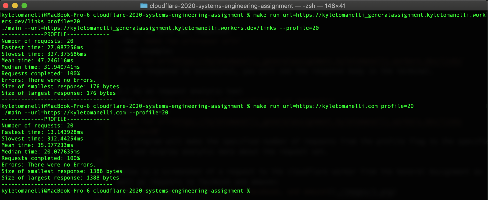
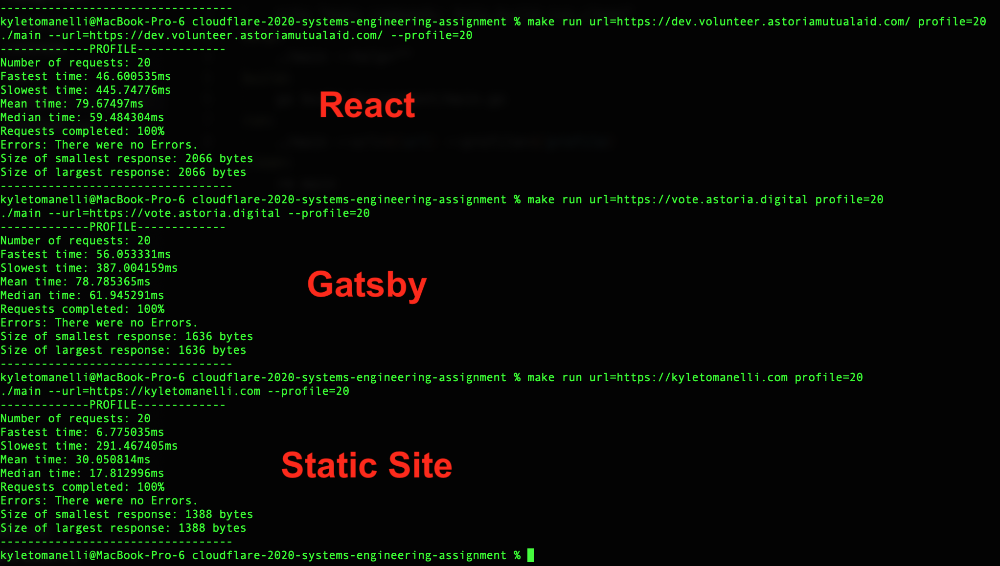

# Systems Assignment

## How to use it:

1.)Run `make build` to build the tool

Once the tool is built, you can run the application in two ways:

2a.) As an HTTP Get requester  
 -Run `make run url=<your url>`  
 -For example:  
`make run url=https://kyletomanelli_generalassignment.kyletomanelli.workers.dev/links`  
If the response is successful, you will see the response body in the terminal.

2b.) As an request analytic tool  
-Run `make run url=<your url> profile=<# of requests>`  
-For example:  
`make run url=https://kyletomanelli_generalassignment.kyletomanelli.workers.dev/links profile=20`  
The program will make the specified number of requests from the profile flag to the specified url and display analytic data about the request set.

Below is a screenshot of a request to the cloudflare worker from the General Assignment as well as requests to facebook and amazon:

As we can see, the worker's response time was much quicker than either facebook or amazon, and this is probably to be expected as facebook and amazon have much more data then the worker.

Let's take a look at a site similar to the worker site. [My personal site](https://kyletomanelli.com) is fairly simple and only has a few links and pictures so that may be more comparable to the worker site.

Now this is a bit more interesting. My personal site was able to load faster on average than the CF worker site, but the worker site has a much smaller response size.

This got me thinking about looking through some analytic data from some other sites. Sites built with Gatsby are supposed to be smaller/quicker to load than a normal react app, so lets confirm that.

Below is a screenshot of analytic data for 3 sites, one of them is a react site I worked on with a team of volunteers, the next is a gatsby site also built by me and a few volunteers, and then my personal site again to see how it stacks up.

The React and Gatsby sites both had similar avg load times and the Gatsby site was slightly smaller as well. The React site was fairly simple so I imagine if that weren't the case, we'd see more of a difference in results here. As for the static site, it was smaller and faster to load than either React or Gatsby.

---

## What is it?

This exercise is a follow-on to the [General Assignment](https://github.com/cloudflare-hiring/cloudflare-2020-general-engineering-assignment), you'll need to complete that first. In this assignment you'll write a program that makes a request to the endpoints you created in the General Assignment. This is a systems assignment so we want to see that you're able to use sockets directly rather than using a library that handles the HTTP request.

## Useful Links

- [A Tour of Go](https://tour.golang.org/welcome/1)
- [The Rust Programming Language](https://doc.rust-lang.org/book/index.html)
- [Cloudflare General Assignment](https://github.com/cloudflare-hiring/cloudflare-2020-general-engineering-assignment)

## Requirements

### 1. Use one of the specified languages

Choose from among C/C++/Go/Rust. If you aren't familiar with these languages, you're not alone! Many engineers join Cloudflare without
specific language experience. See the Useful Links section for some quickstart guides.

### 2. Use an off the shelf build tool

Choose something to build your assignment that works with the language you chose (Cargo, Make, CMake etc.). Include instructions in your readme on how to build and run your program. Don't check-in binaries, we won't run a pre-compiled binary.

### 3. Do **NOT** use a library to handle the HTTP request

We want to see how familiar you are with systems work. Although we would normally recommend using a library to handle HTTP requests, for this assignment we want to see how you handle it yourself.

### 4. Create a CLI tool that makes a request to your links page

Your CLI tool should take an argument that is a full URL (--url). The tool will make an HTTP request to the URL and print the response directly to the console. Test the CLI tool by specifying the /links URL in your General Assignment and make sure it prints the entire json document with all your links.

Your CLI tool should also allow a --help parameter that describes how to use it.

Feel free to use a library to handle command line argument parsing (getopt etc.).

### 5. Measure how fast it is

Next, add logic to your tool to profile your page. Add a new argument --profile that takes a positive integer. Your tool should make that number of requests to your site. Time the requests and print:

- The number of requests
- The fastest time
- The slowest time
- The mean & median times
- The percentage of requests that succeeded
- Any error codes returned that weren't a success
- The size in bytes of the smallest response
- The size in bytes of the largest response

Include a screenshot of your tool run against your site and another webpage.

Test your tool against your site and some other websites. Let us know what you find in your readme. Include outputs for popular sites and your own. How do we compare?

## Submitting your project

When submitting your project, you should prepare your code for upload to Greenhouse. The preferred method for doing this is to create a "ZIP archive" of your project folder: for more instructions on how to do this on Windows and Mac, see [this guide](https://www.sweetwater.com/sweetcare/articles/how-to-zip-and-unzip-files/).

Please provide the source code only, a compiled binary is not necessary.
